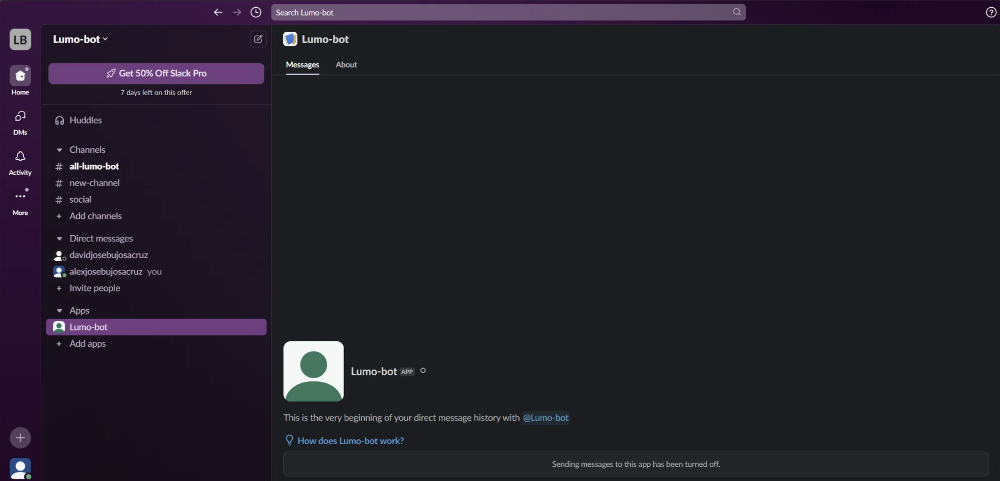

This guide provides concise steps to build a **SlackBot**, from creating the app to configuring essential features like Socket Mode and App Home. Whether you want to send automated messages, listen to channel events, or implement interactive workflows, this guide focuses on practical implementation with clear steps. Let’s dive into the setup process and bring your **SlackBot** to life!

### Following the basics

1. General Explanation of Slack Bot
2. Tutorial (Ping Pong)

# General Explanation about creating a Slackbot

**What is a Slackbot?**

A **Slackbot** is a program or application integrated into Slack that automates tasks, interacts with users, and enhances productivity within a workspace. It acts as a virtual assistant, capable of responding to commands, sending notifications, and executing workflows.

**Key features of a slackbot**

- **Automated Responses**: Reacts to specific messages or keywords with predefined replies.
- **Task Automation**: Handles repetitive tasks like reminders, alerts, or report generation.
- **Interactive Workflows**: Engages users with buttons, menus, or forms for seamless interaction.
- **Real-Time Communication**: Sends and receives messages instantly, often using Slack's Real-Time Messaging (RTM) API or Socket Mode.
- **Integration with APIs**: Connects to external services like Google Calendar, GitHub, or custom APIs to perform complex operations.

---

**Slack Architecture and Permission System**

**Slack Architecture**

Slack integrations are built on an event-driven architecture complemented by a permission management system. This architecture includes the following components:

- **Slack Events API**: Enables applications to receive notifications about activities within a workspace, such as sent messages, added reactions, or channel changes.
- **Webhooks**: Slack uses webhooks to send real-time events to your application or server.
- **RTM (Real-Time Messaging)**: For real-time integrations, Slack offers a WebSocket connection that allows instant message sending and receiving.

**Permission Management System**

- **Scopes**: Each app requests specific permissions to access data or perform actions on behalf of the user or team.
  - `channels:read`: Grants access to channel information.
  - `chat:write`: Allows sending messages to chats.
  - `users:read`: Retrieves information about the user interacting with the app.
- **Access Tokens**: Slack generates access tokens to authenticate requests.
  - **User Token**: Provides access to user-specific data.
  - **Bot Token**: Grants access to data and functionalities for the bot.

**Interaction between Events & Permissions**

- Events generated by Slack are sent to registered applications via webhooks.
- Before processing an event, Slack verifies the permissions (Scopes) requested by the app to ensure it can only access authorized data and actions.

---

**Getting Started**

To create a **SlackBot**, visit the Slack API page. Navigate to the **Applications** section and click **Create App**. This will allow you to establish necessary connections, obtain environment variables, and configure permissions.

Two options to create an **SlackBot**

- **From Manifest**: Define your app’s configuration in a JSON or YAML file.
- **From Scratch**: Use Slack’s UI to manage basic information, scopes, settings, and features.

Choose your app’s name and the workspace where you’ll develop your bot.

Its very important to create an interaction between Slack API and your backend, use environment variables for connecting with the Slack API and Bot Token and User Token for granted permission like responses back and so on.

When developing a **SlackBot**, two essential components to enable seamless communication with Slack are **Socket Mode** and **Event Subscription**. These features work together to establish real-time connectivity and allow your bot to react to events efficiently.

---

**Socket Mode**

Socket Mode is essential for establishing a real-time connection between your app and Slack, especially useful when your app doesn’t have a public URL.

**Steps:**

1. Navigate to **Socket Mode** in the Slack Developer Portal.
2. Turn ON **Socket Mode** to enable it.
   - This generates an **APP_LEVEL_TOKEN**.
3. Ensure the `connections:write` scope is enabled to send real-time messages.

---

**Event Subscription**

Event Subscription allows your application to receive notifications about events occurring in a Slack workspace. This enables your bot to react to specific events in real time.

**Key features**

- Connect your backend with the Slack API.
- Listen to messages in public/private channels or direct messages.
- Detect events like channel creation, message reactions, or profile updates.
- Implement interactive workflows, such as automated responses or custom commands.

---

**Sending messages**

Sending messages as a bot requires proper configuration of permissions and scopes to ensure smooth interaction.

**steps:**

1. **scopes**
   - `im:history`: Read messages in direct message channels.
   - `chat:write`: Send messages as the bot.
2. **tokens**
   - **User Token**: Handles user-specific actions.
   - **Bot Token**: Manages bot-specific operations.
3. **event subscription**

   Subscribe to the `message.im` event in Event Subscriptions to handle direct messages effectively.

---

**App home**

The **App Home** provides a central interface for users to interact with your bot beyond direct messages, offering dynamic and personalized content.

**steps to enable:**

1. **show bot as online**

   Ensure your bot appears online to enhance visibility and responsiveness.

2. **enable tabs**
   - Turn ON the **Home tab** for dynamic and customizable content.
   - Turn ON the **Messages tab** for private conversations with users.
3. **slash commands**

   Implement **Slash Commands** to offer users quick and intuitive actions.

4. **update home view dynamically**

   Use the `app_home_opened` event (configured in Event Subscriptions) to provide users with real-time updates on the Home tab.

---

**Slack Development Important Terms**

When you are developing a functionality in your API, it’s very important to know the differences between **actions**, **events**, and **views** refer to different types of interactions and behaviors within the Slack platform. Here’s a breakdown of each:

**Action**

An **action** is a specific user interaction that triggers a response within the Slack app. These actions are often part of **interactive components** such as buttons, menus, or select options within messages or Slack views.

- **Examples**:
  - Clicking a button in a message.
  - Selecting an option from a dropdown.
  - Submitting a form from a modal.
- **Key Point**: Actions are typically used to allow users to interact with Slack messages or modals, triggering a response from the app.

**Event**

An **event** is a notification from Slack that an activity has occurred within a workspace. These events are sent to your app's backend when certain actions happen, and your app can react to these events in real time.

- **Examples**:
  - A new message is posted in a channel (`message.channels` event).
  - A user joins a channel (`member_joined_channel` event).
  - A user reacts to a message (`reaction_added` event).
- **Key Point**: Events are used to notify your app of activities happening in Slack, which can trigger workflows, notifications, or other actions in response.

**View**

A **view** is a Slack interface element used to display content to users, typically in the form of modals or interactive panels within Slack. Views allow for rich, interactive UIs like forms, buttons, and selections.

- **Examples**:
  - A modal that appears when a user clicks a button.
  - A home tab inside a Slack app that shows information and allows users to interact with different components.
- **Key Point**: Views allow you to create custom user interfaces that go beyond standard messages, enabling more complex interactions within Slack, such as multi-step workflows, forms, or settings pages.

---

# Tutorial (Ping and Pong)

### Prerequisites

- Installed **Ngrok**
- Installed **_Node Js_**
- Use a code editor like **VsCode**

## Set Up the Project

1. Initialize a **NodeJs Project**

   - Create a Slackbot lumo-bot folder

   - Go to the lumo-bot folder & initialize folder
     ```bash
     npm install @slack/bolt dotenv
     ```

2. Install necessary dependencies:
   - Installation of npm dependencies
     ```bash
     npm install @slack/bolt dotenv
     ```
3. Create Env File

   ```
   PORT=

   SLACK_APP_ID=
   SLACK_CLIENT_ID=
   SLACK_CLIENT_SECRET=
   SLACK_SIGNING_SECRET=
   SLACK_VERIFICATION_TOKEN=
   SLACK_BOT_TOKEN=
   SLACK_APP_LEVEL_TOKEN=

   ```

4. Install the following dependencies

   ```bash
   npm install -D ts-node nodemon typescript
   ```

5. Create the following file `index.ts`

   ```tsx
   import { App, SayFn } from "@slack/bolt";
   import { configDotenv } from "dotenv";

   // Initialize the app with your bot token and signing secret

   configDotenv();

   const app = new App({
     appToken: process.env.SLACK_APP_LEVEL_TOKEN,
     token: process.env.SLACK_BOT_TOKEN,
     signingSecret: process.env.SLACK_SIGNING_SECRET,
     socketMode: true,
   });

   // Listen for messages containing "hello"
   app.message(
     "hello",
     async ({ message, say }: { message: any; say: SayFn }) => {
       await say(`Hey there, <@${message.user}>!`);
     }
   );

   app.message(
     "ping",
     async ({ message, say }: { message: any; say: SayFn }) => {
       await say(`Pong!!!`);
     }
   );

   // Start the app
   (async () => {
     const port = process.env.PORT || 3000;
     await app.start(port);
     console.log(`⚡️ Slack bot is running on port ${port}`);
   })();
   ```

6. Add a Script in the `Package.json`

   ```tsx
   {
   	// Other Objects describes
   	"scripts": {
   		"dev": "nodemon --watch . --ext ts --exec ts-node app.ts"
   	}
   }
   ```

7. Add the following to the tsconfig.json

   ```json
   {
     "compilerOptions": {
       "target": "ES2020",
       "module": "commonjs",
       "strict": true,
       "esModuleInterop": true,
       "skipLibCheck": true
     }
   }
   ```

## Interact with Slack Bot API

1. Go to the following link
   - Link: [Slack API: Applications | Slack](https://api.slack.com/apps)
2. Click on Create App
   - Select from Scratch
3. Fill the following fields
   - App Name
   - Workspace Name
4. Update the Env File with the basic information

   ```
   PORT=3000

   SLACK_APP_ID=
   SLACK_CLIENT_ID=
   SLACK_CLIENT_SECRET=
   SLACK_SIGNING_SECRET=
   SLACK_VERIFICATION_TOKEN=
   SLACK_BOT_TOKEN=
   SLACK_APP_LEVEL_TOKEN=

   ```

5. Go to the **Socket Mode Panel**

   1. Assign a name to the socket mode

   

6. Extract the token and update the environment file

   ```
   PORT=

   SLACK_APP_ID=
   SLACK_CLIENT_ID=
   SLACK_CLIENT_SECRET=
   SLACK_SIGNING_SECRET=
   SLACK_VERIFICATION_TOKEN=
   SLACK_BOT_TOKEN=
   SLACK_APP_LEVEL_TOKEN=

   ```

7. Go to **OAuthSubscription Panel**
   - Add two permission
     - Chat:write
     - im:history
8. Go to **Event Subscription Panel**
   1. In App unfurl domains, do the following:
      - Open ngrok and run as administrator
      - Run `ngrok http 3000`
      - Add a new Domain link: For interact with the **_Node.Js App_**
      - Save Changes
   2. In Subscribe to bot Events, do the following
      - Add `message.im` to enable **Slackbot** to send a direct message
      - Save Changes
9. Install the **app** in your **workspace**

   - Go to the **Install App Panel**
   - Select Channel to post
   - Current View of the Slackbot in **Workspace**

   

10. Reinstall the app for post message in the **Lumo App**

    1. Get the the bot token in the **OAuth & Permissions**
    2. Update the environment file

    ```
    PORT=3000

    SLACK_APP_ID=
    SLACK_CLIENT_ID=
    SLACK_CLIENT_SECRET=
    SLACK_SIGNING_SECRET=
    SLACK_VERIFICATION_TOKEN=
    SLACK_BOT_TOKEN=
    SLACK_APP_LEVEL_TOKEN=

    ```

## Run the Node.Js Project

1. Run the project with the following commands

   ```bash
   npm run dev
   ```

2. If the send message is unavailable
   1. Reload the workspace
   2. Reinstall the bot

## Solution Completed


